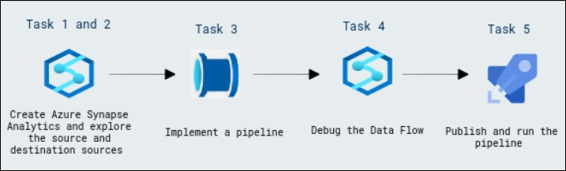
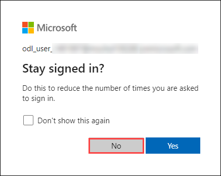
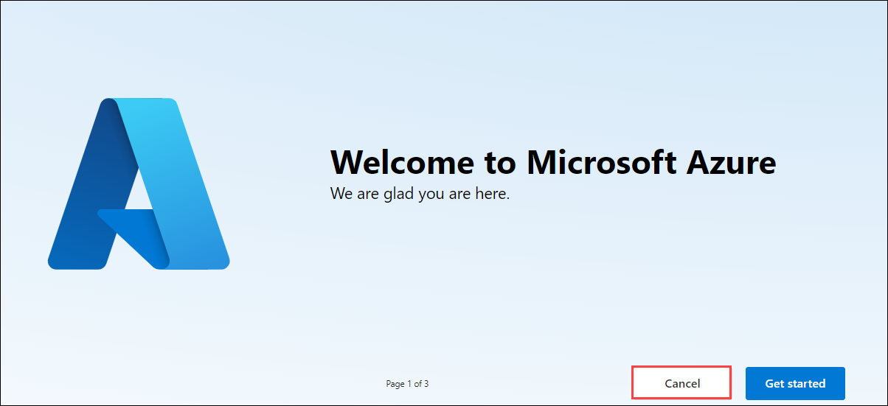

# Build a Data Pipeline in Synapse Analytics

### Overall Estimated Duration: 60 Minutes

## Overview

In this hands-on lab, you will build a data pipeline in Azure Synapse Analytics, enabling efficient data integration and transformation processes. Azure Synapse Analytics provides a robust platform for data engineering, combining data storage, integration, and analytics. You will begin by provisioning a Synapse Analytics workspace and configuring the necessary resources, including a dedicated SQL pool and linked storage accounts. You will then explore the source data files and destination tables to understand the data flow before implementing a pipeline that incorporates a data flow for extracting, transforming, and loading product data. The lab includes steps to debug the pipeline, ensuring the data flow logic works as intended, followed by publishing and executing the pipeline to validate the data integration process. By completing this lab, you will gain practical experience in leveraging Azure Synapse Analytics for managing and transforming data within an enterprise data warehouse.

## Objective

This lab is aimed at providing learners hands-on experience with Azure Synapse Analytics by building and debugging a data pipeline to integrate and transform data into a dedicated SQL pool. By the end of this lab, you will be able to:

- **Get started with Azure Synapse Analytics:** This hands-on exercise is designed to teach you the fundamentals of using Azure Synapse Analytics to manage data flows and perform transformations. Participants will set up an Azure Synapse Analytics workspace and begin leveraging its capabilities to integrate data into a data warehouse.

- **Build and debug a data pipeline:** You will create a pipeline that encapsulates a data flow, including data ingestion, transformation, and loading. This pipeline will use Azure Synapse Analytics to insert new data and update existing records in a dedicated SQL pool.

- **Publish and execute the pipeline:** Learn how to publish the pipeline and run it effectively, verifying the successful transfer and transformation of data into a target table within a data warehouse.

## Prerequisites

Participants should have:

- **SQL for Data Analysis:** Ability to write and optimize SQL queries for data extraction and transformation.

- **Basic Knowledge of Machine Learning Concepts:** Familiarity with machine learning algorithms, model evaluation metrics, and training workflows.

- **Cloud Platform Familiarity:** Hands-on experience with cloud environments such as AWS, Azure, or Google Cloud, including working with storage and compute resources.

- **Version Control with Git:** Understanding of Git for managing code changes, including branching and merging.

## Architecture

The architecture is a cloud-based data processing workflow leveraging distributed computing and data analytics platforms. It integrates a scalable cloud environment for data storage and processing with tools like Apache Spark for distributed data transformation and analysis. Data is ingested from multiple sources into a centralized data lake or storage solution, processed through Spark clusters, and made available for querying and visualization via interactive notebooks or dashboards. This setup ensures high performance, scalability, and seamless collaboration, enabling efficient handling of large datasets and complex analytical workflows.

## Architecture Diagram

   

## Explanation of Components

The architecture for this lab involves the following key components:

- **Azure Synapse Analytics:** A cloud-based integrated analytics platform that enables the creation of data pipelines, data flows, and transformation activities, allowing efficient integration, querying, and management of large datasets across multiple sources and destinations.  

- **Data Flow Activity:** A powerful component within Azure Synapse that allows users to build and orchestrate complex data transformations, including ingesting, filtering, aggregating, and transforming data from different sources to a target destination.  

- **Lookup Transformation:** A key data flow component that enables the matching of incoming data with an existing dataset, allowing for the identification of records in a data warehouse and the execution of conditional logic like insertions or updates based on whether a match is found.  

## Getting Started with Lab
 
Once you're ready to dive in, your virtual machine and lab guide will be right at your fingertips within your web browser.
 

### Virtual Machine & Lab Guide
 
Your virtual machine is your workhorse throughout the workshop. The lab guide is your roadmap to success.
 
## Exploring Your Lab Resources
 
To get a better understanding of your lab resources and credentials, navigate to the **Environment** tab.
 

 
## Utilizing the Split Window Feature
 
For convenience, you can open the lab guide in a separate window by selecting the **Split Window** button from the Top right corner.
 

 
## Managing Your Virtual Machine
 
Feel free to start, stop, or restart your virtual machine as needed from the **Resources** tab. Your experience is in your hands!
 

## **Lab Duration Extension**

1. To extend the duration of the lab, kindly click the **Hourglass** icon in the top right corner of the lab environment. 

    

    >**Note:** You will get the **Hourglass** icon when 10 minutes are remaining in the lab.

2. Click **OK** to extend your lab duration.
 
   

3. If you have not extended the duration prior to when the lab is about to end, a pop-up will appear, giving you the option to extend. Click **OK** to proceed.
 
## Let's Get Started with Azure Portal
 
1. On your virtual machine, click on the Azure Portal icon as shown below:
 
   .png)

 
2. You'll see the **Sign into Microsoft Azure** tab. Here, enter your credentials:
 
   - **Email/Username:** <inject key="AzureAdUserEmail"></inject>
 
       
 
3. Next, provide your password:
 
   - **Password:** <inject key="AzureAdUserPassword"></inject>
 
      
 
4. If prompted to stay signed in, you can click "No."

    

5. If **Action required** pop-up window appears, click on **Ask later**.

   

6. If a **Welcome to Microsoft Azure** pop-up window appears, simply click "Cancel" to skip the tour.

    

## Support Contact
 
The CloudLabs support team is available 24/7, 365 days a year, via email and live chat to ensure seamless assistance at any time. We offer dedicated support channels tailored specifically for both learners and instructors, ensuring that all your needs are promptly and efficiently addressed.

Learner Support Contacts:
- Email Support: cloudlabs-support@spektrasystems.com
- Live Chat Support: https://cloudlabs.ai/labs-support

Click "Next" from the bottom right corner to embark on your Lab journey!
 
   .png)
 
### Happy Learning!!