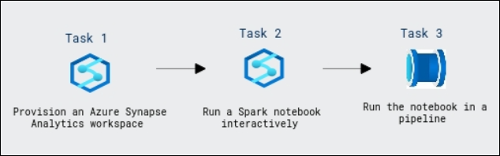

# Build a Data Pipeline in Synapse Analytics

### Overall Estimated Duration: 60 Minutes

## Overview

In this hands-on lab, you will provision an Azure Synapse Analytics workspace, interactively run a Spark notebook, and automate the transformation of data by executing the notebook within a pipeline. The lab starts by guiding you through the steps to create an Azure Synapse workspace, including configuring a Spark pool and linking your storage account. You will then run a Spark notebook to transform sales data interactively, using Apache Spark to load, process, and save the data in a new format. Lastly, you'll automate the entire process by creating a pipeline that runs the notebook, enabling you to efficiently handle large datasets in a scalable manner. This lab enhances your understanding of Spark in Azure Synapse Analytics and its integration with data pipelines.

## Objective

This lab is aimed to give learners hands-on experience with Azure Synapse Analytics, focusing on running Spark notebooks interactively and automating data transformation processes within pipelines. By the end of this lab, you will be able to:

- **Provision an Azure Synapse Analytics workspace:** This exercise will guide you through setting up an Azure Synapse Analytics workspace with access to data lake storage and a Spark pool, enabling you to work with large-scale data processing.

- **Run a Spark notebook interactively:** You will learn how to use Synapse Studio to run a Spark notebook, interactively transforming data and saving the results in a different format.

- **Automate data transformation with a pipeline:** You will create a pipeline to run the Spark notebook automatically, streamlining data processing and enabling you to handle large datasets efficiently.

## Prerequisites

Participants should have:

- **Azure Synapse Analytics:** Familiarity with Azure Synapse Analytics, including understanding its components like workspaces, Spark pools, and data integration.

- **Apache Spark and Notebooks:** Knowledge of Spark concepts and how to work with Spark notebooks for data processing and transformation.

- **Azure Data Lake Storage:** Understanding of Azure Data Lake Storage and how to manage and interact with data stored in it.

- **Azure Pipelines:** Knowledge of creating and managing data pipelines in Azure Synapse, including configuring activities and linking them to notebooks for automation.

## Architecture

The architecture for this lab involves provisioning an Azure Synapse Analytics workspace, which includes setting up a Spark pool and linking it to an Azure Data Lake Storage account. Data from the storage account is processed using an Apache Spark notebook, which is run interactively to transform raw sales data into a more structured format (e.g., Parquet). The transformed data is saved back to the Data Lake storage. To automate this process, the notebook is encapsulated within an Azure Synapse pipeline, allowing for the execution of the notebook as part of an orchestrated data flow. The pipeline can be triggered either manually or on a schedule, making the entire data transformation process scalable and repeatable. The integration of these components in a seamless workflow enables efficient data processing at scale.

## Architecture Diagram

   

## Explanation of Components

The architecture for this lab involves the following key components:

- **Azure Synapse Analytics Workspace:** This is the core environment where data processing and transformation tasks are managed. It integrates various services, including Spark pools and Data Lake Storage, enabling seamless data operations and analytics.

- **Apache Spark Pool:** A cluster of resources in Synapse that provides scalable distributed processing power for running Spark notebooks. It's essential for processing large datasets in parallel, making it ideal for big data transformations.

- **Azure Synapse Pipelines:** These are used for orchestrating and automating data workflows. By encapsulating the Spark notebook in a pipeline, it enables efficient automation of data transformation tasks, improving scalability and repeatability.

## Getting Started with Lab
 
Once you're ready to dive in, your virtual machine and lab guide will be right at your fingertips within your web browser.
 

### Virtual Machine & Lab Guide
 
Your virtual machine is your workhorse throughout the workshop. The lab guide is your roadmap to success.
 
## Exploring Your Lab Resources
 
To get a better understanding of your lab resources and credentials, navigate to the **Environment** tab.
 

 
## Utilizing the Split Window Feature
 
For convenience, you can open the lab guide in a separate window by selecting the **Split Window** button from the Top right corner.
 

 
## Managing Your Virtual Machine
 
Feel free to start, stop, or restart your virtual machine as needed from the **Resources** tab. Your experience is in your hands!
 

## **Lab Duration Extension**

1. To extend the duration of the lab, kindly click the **Hourglass** icon in the top right corner of the lab environment. 

    

    >**Note:** You will get the **Hourglass** icon when 10 minutes are remaining in the lab.

2. Click **OK** to extend your lab duration.
 
   

3. If you have not extended the duration prior to when the lab is about to end, a pop-up will appear, giving you the option to extend. Click **OK** to proceed.
 
## Let's Get Started with Azure Portal
 
1. On your virtual machine, click on the Azure Portal icon as shown below:
 
   .png)

 
2. You'll see the **Sign into Microsoft Azure** tab. Here, enter your credentials:
 
   - **Email/Username:** <inject key="AzureAdUserEmail"></inject>
 
       
 
3. Next, provide your password:
 
   - **Password:** <inject key="AzureAdUserPassword"></inject>
 
      
 
4. If prompted to stay signed in, you can click "No."

    

5. If **Action required** pop-up window appears, click on **Ask later**.

   

6. If a **Welcome to Microsoft Azure** pop-up window appears, simply click "Cancel" to skip the tour.

    

## Support Contact
 
The CloudLabs support team is available 24/7, 365 days a year, via email and live chat to ensure seamless assistance at any time. We offer dedicated support channels tailored specifically for both learners and instructors, ensuring that all your needs are promptly and efficiently addressed.

Learner Support Contacts:
- Email Support: cloudlabs-support@spektrasystems.com
- Live Chat Support: https://cloudlabs.ai/labs-support

Click "Next" from the bottom right corner to embark on your Lab journey!
 
   .png)
 
### Happy Learning!!