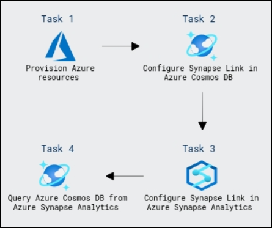

# Build a Data Pipeline in Synapse Analytics

### Overall Estimated Duration: 60 Minutes

## Overview

In this hands-on lab, you will explore the process of integrating Azure Synapse Link with Azure Cosmos DB to enable hybrid transactional and analytical processing (HTAP). The lab begins by provisioning the necessary Azure resources, including an Azure Synapse Analytics workspace and an Azure Cosmos DB account. You will then enable the Synapse Link feature in Cosmos DB and create a container for analytical data. Following this, you will configure Synapse Link in Azure Synapse Analytics to link the Cosmos DB data, allowing you to query and analyze it. Using both Spark pools and serverless SQL pools in Synapse Analytics, you will query the Cosmos DB data, manipulate it, and observe how data modifications in Cosmos DB are reflected in Synapse Analytics, providing you with a comprehensive understanding of near-real-time analytics using Synapse Link.

## Objective

This lab is aimed to give learners hands-on experience with Azure Synapse Link for Azure Cosmos DB and its integration with Azure Synapse Analytics for performing near-real-time analytics over operational data. By the end of this lab, you will be able to:

- **Get started with Azure Synapse Link for Azure Cosmos DB:** This hands-on exercise aims to teach you the fundamentals of integrating Azure Cosmos DB with Azure Synapse Analytics for real-time analytics. Participants will enable Synapse Link in Cosmos DB, set up an analytical store, and establish connections between Cosmos DB and Synapse Analytics. 

- **Query Azure Cosmos DB using Synapse Analytics:** You will learn how to query data stored in Azure Cosmos DB using both Spark and SQL pools in Azure Synapse Analytics, allowing for efficient analysis of operational data without complex ETL processes.

## Prerequisites

Participants should have:

- **Azure Cosmos DB Concepts:** Understanding of Azure Cosmos DB, its data models (SQL API, NoSQL, etc.), and how to manage containers and databases within the service.

- **Azure Synapse Analytics Overview:** Familiarity with Azure Synapse Analytics, including its capabilities for data integration, querying, and analytics using both Spark and SQL pools.

- **Basic Azure Resource Management:** Knowledge of how to provision and manage Azure resources like Cosmos DB, Synapse Analytics, and storage accounts through the Azure portal or using PowerShell.

- **Data Querying and Analytical Processing:** Experience with querying operational data using SQL and Spark, and understanding how analytical processing works with large-scale data systems.

 
## Architecture

The architecture for this lab integrates Azure Synapse Link with Azure Cosmos DB to enable hybrid transactional and analytical processing (HTAP). Data from Azure Cosmos DB is stored and managed in a NoSQL database, with containers holding operational data. By enabling Synapse Link, the operational data is automatically synced to an analytical store for near-real-time analytics. Azure Synapse Analytics then connects to the Cosmos DB account, allowing data to be queried and analyzed using Spark and SQL pools. This setup eliminates the need for complex ETL processes, enabling seamless and efficient analytics on live data from Cosmos DB. The solution leverages cloud-native services for scalable data integration, processing, and analysis across platforms.

## Architecture Diagram

   

## Explanation of Components

The architecture for this lab involves the following key components:

- **Azure Synapse Link for Azure Cosmos DB:** A key component that enables seamless integration of operational data from Cosmos DB into an analytical store for real-time analytics, without the need for complex ETL processes.

- **Azure Synapse Analytics Workspace:** This workspace allows users to manage and analyze data at scale, providing capabilities to query Cosmos DB data using Spark and SQL pools, and perform advanced analytics.

- **Azure Cosmos DB Analytical Store:** A specialized container used for storing data in a way optimized for analytics, supporting real-time data queries from external tools like Azure Synapse without impacting operational workloads.

## Getting Started with Lab
 
Once you're ready to dive in, your virtual machine and lab guide will be right at your fingertips within your web browser.
 

### Virtual Machine & Lab Guide
 
Your virtual machine is your workhorse throughout the workshop. The lab guide is your roadmap to success.
 
## Exploring Your Lab Resources
 
To get a better understanding of your lab resources and credentials, navigate to the **Environment** tab.
 

 
## Utilizing the Split Window Feature
 
For convenience, you can open the lab guide in a separate window by selecting the **Split Window** button from the Top right corner.
 

 
## Managing Your Virtual Machine
 
Feel free to start, stop, or restart your virtual machine as needed from the **Resources** tab. Your experience is in your hands!
 

## **Lab Duration Extension**

1. To extend the duration of the lab, kindly click the **Hourglass** icon in the top right corner of the lab environment. 

    

    >**Note:** You will get the **Hourglass** icon when 10 minutes are remaining in the lab.

2. Click **OK** to extend your lab duration.
 
   

3. If you have not extended the duration prior to when the lab is about to end, a pop-up will appear, giving you the option to extend. Click **OK** to proceed.
 
## Let's Get Started with Azure Portal
 
1. On your virtual machine, click on the Azure Portal icon as shown below:
 
   .png)

 
2. You'll see the **Sign into Microsoft Azure** tab. Here, enter your credentials:
 
   - **Email/Username:** <inject key="AzureAdUserEmail"></inject>
 
       
 
3. Next, provide your password:
 
   - **Password:** <inject key="AzureAdUserPassword"></inject>
 
      
 
4. If prompted to stay signed in, you can click "No."

    

5. If **Action required** pop-up window appears, click on **Ask later**.

   

6. If a **Welcome to Microsoft Azure** pop-up window appears, simply click "Cancel" to skip the tour.

    

## Support Contact
 
The CloudLabs support team is available 24/7, 365 days a year, via email and live chat to ensure seamless assistance at any time. We offer dedicated support channels tailored specifically for both learners and instructors, ensuring that all your needs are promptly and efficiently addressed.

Learner Support Contacts:
- Email Support: cloudlabs-support@spektrasystems.com
- Live Chat Support: https://cloudlabs.ai/labs-support

Click "Next" from the bottom right corner to embark on your Lab journey!
 
   .png)
 
### Happy Learning!!