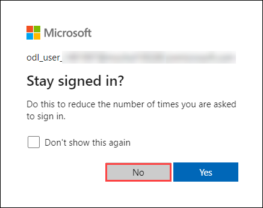

# Build a Data Pipeline in Synapse Analytics

### Overall Estimated Duration: 60 Minutes

## Overview

In this hands-on lab, you will set up Azure Synapse Link for SQL to synchronize data from an Azure SQL Database to an Azure Synapse Analytics workspace. This synchronization enables efficient low-latency analytical workloads in Synapse Analytics without burdening the operational database. Throughout the lab, you will provision the necessary Azure resources, configure the Azure SQL Database with required settings, and explore the transactional database. Additionally, you will configure Azure Synapse Link by starting the dedicated SQL pool, creating a schema, and setting up a link connection for data synchronization. Finally, you will view the replicated data and run analytical queries in Synapse Analytics, allowing you to perform analytical tasks while ensuring minimal impact on business applications.

## Objective

This lab is aimed to give learners hands-on experience with Azure Synapse Link for SQL, enabling them to synchronize data between an Azure SQL Database and an Azure Synapse Analytics workspace for low-latency analytical workloads. By the end of this lab, you will be able to:

- **Provision the required Azure resources:** This hands-on exercise teaches you how to provision the necessary resources for Azure Synapse Link, including setting up an Azure SQL Database and Synapse Analytics workspace.
  
- **Explore the transactional database:** Learn how to explore a sample transactional database and understand the operational data before synchronization.

- **Set up Azure Synapse Link for SQL:** You will configure Azure Synapse Link to synchronize data from Azure SQL Database to Synapse Analytics, enabling you to run low-latency analytical queries.

- **View and analyze replicated data:** After synchronization, you will query the replicated data in the dedicated SQL pool in Synapse Analytics, allowing you to perform analytical tasks without impacting operational workloads.

## Prerequisites

Participants should have:

- **Azure SQL Database and Synapse Analytics Knowledge:** Understanding of Azure SQL Database and Azure Synapse Analytics, including their architecture, components, and basic configurations.

- **Familiarity with PowerShell and Script Execution:** Knowledge of running PowerShell scripts within the Azure Cloud Shell environment for provisioning and configuring resources.

- **SQL Querying and Database Management:** Experience with querying databases using SQL, exploring tables, and managing database schemas.

- **Azure Resource Management and Security Configuration:** Familiarity with managing Azure resources and configuring security settings such as firewall rules and managed identities for Azure services.

- **Basic Understanding of Data Integration Concepts:** Knowledge of how data integration works, especially regarding syncing data between operational and analytical systems.

## Architecture

The architecture in this lab involves integrating an Azure SQL Database with Azure Synapse Analytics to enable low-latency synchronization of transactional data for analytical workloads. The Azure SQL Database serves as the source, where operational data resides, and the Azure Synapse Analytics workspace, with its dedicated SQL pool, acts as the destination for synchronized data. Azure Synapse Link facilitates the seamless synchronization between the two, ensuring that data from the SQL Database is automatically replicated to the dedicated SQL pool in Synapse Analytics for analytics purposes. This architecture enables users to perform complex analytical queries on the replicated data without impacting the operational database, optimizing performance for both transactional and analytical tasks. The system also includes necessary configurations such as managed identities, firewall settings, and linked services to establish secure communication between the databases and the analytics platform.

## Architecture Diagram

   

## Explanation of Components

The architecture for this lab involves the following key components:

- **Azure Synapse Link for SQL:** This component enables low-latency synchronization of operational data from Azure SQL Database to Azure Synapse Analytics, allowing for real-time analytics without placing a load on the source database.

- **Dedicated SQL Pool in Synapse Analytics:** It serves as the target destination for replicated data, providing a scalable platform to run complex analytical queries without affecting the performance of transactional systems.

- **Linked Services in Synapse Studio:** Linked services provide the necessary connection between the Azure SQL Database and the Synapse Analytics workspace, facilitating secure data movement and synchronization between the operational and analytical environments.

## Getting Started with Lab
 
Once you're ready to dive in, your virtual machine and lab guide will be right at your fingertips within your web browser.
 

### Virtual Machine & Lab Guide
 
Your virtual machine is your workhorse throughout the workshop. The lab guide is your roadmap to success.
 
## Exploring Your Lab Resources
 
To get a better understanding of your lab resources and credentials, navigate to the **Environment** tab.
 

 
## Utilizing the Split Window Feature
 
For convenience, you can open the lab guide in a separate window by selecting the **Split Window** button from the Top right corner.
 

 
## Managing Your Virtual Machine
 
Feel free to start, stop, or restart your virtual machine as needed from the **Resources** tab. Your experience is in your hands!
 

## **Lab Duration Extension**

1. To extend the duration of the lab, kindly click the **Hourglass** icon in the top right corner of the lab environment. 

    

    >**Note:** You will get the **Hourglass** icon when 10 minutes are remaining in the lab.

2. Click **OK** to extend your lab duration.
 
   

3. If you have not extended the duration prior to when the lab is about to end, a pop-up will appear, giving you the option to extend. Click **OK** to proceed.
 
## Let's Get Started with Azure Portal
 
1. On your virtual machine, click on the Azure Portal icon as shown below:
 
   .png)

 
2. You'll see the **Sign into Microsoft Azure** tab. Here, enter your credentials:
 
   - **Email/Username:** <inject key="AzureAdUserEmail"></inject>
 
       
 
3. Next, provide your password:
 
   - **Password:** <inject key="AzureAdUserPassword"></inject>
 
      
 
4. If prompted to stay signed in, you can click "No."

    

5. If **Action required** pop-up window appears, click on **Ask later**.

   

6. If a **Welcome to Microsoft Azure** pop-up window appears, simply click "Cancel" to skip the tour.

    

## Support Contact
 
The CloudLabs support team is available 24/7, 365 days a year, via email and live chat to ensure seamless assistance at any time. We offer dedicated support channels tailored specifically for both learners and instructors, ensuring that all your needs are promptly and efficiently addressed.

Learner Support Contacts:
- Email Support: cloudlabs-support@spektrasystems.com
- Live Chat Support: https://cloudlabs.ai/labs-support

Click "Next" from the bottom right corner to embark on your Lab journey!
 
   .png)
 
### Happy Learning!!