# Lab 01: Explore Azure Databricks

## Lab-Scenario

Azure Databricks is a Microsoft Azure-based version of the popular open-source Databricks platform.

Similarly to Azure Synapse Analytics, an Azure Databricks *workspace* provides a central point for managing Databricks clusters, data, and resources on Azure.

In this lab, you'll learn about Azure Databricks workspace which provides a central point for managing Databricks clusters, data, and resources on Azure.

### Objectives

In this lab, you will perform:

 - Task 1: Provision an Azure Databricks workspace
 - Task 2: Create a cluster
 - Task 3: Use Spark to analyze a data file
 - Task 4: Create and query table

 ### Estimated timing: 60 minutes
 
 ### Architecture Diagram

   

## Task 1: Provision an Azure Databricks workspace

In this task, you'll use a script to provision a new Azure Databricks workspace.

1. In a web browser, sign into the [Azure portal](https://portal.azure.com) at `https://portal.azure.com`.
   
1. Use the **[\>_]** button to the right of the search bar at the top of the page to create a new Cloud Shell in the Azure portal.

    

    >**Note:** If you are not able to see the **[\>_]** button, click on the **ellipses (1)** to the right of the search bar at the top of the page and then select **Cloud Shell (2)** from the drop down options.

    

1. Selecting a ***PowerShell*** environment and creating storage if prompted. The cloud shell provides a command line interface in a pane at the bottom of the Azure portal, as shown here:

   

1. Within the Getting started pane, select **Mount storage account (1)**, select your **Storage account subscription (2)** from the dropdown and click **Apply (3)**.

   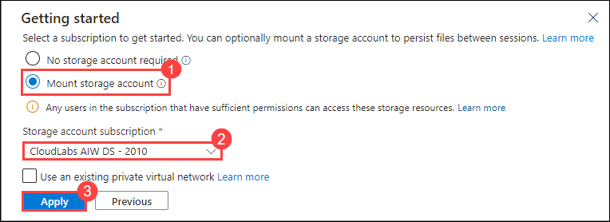

1. Within the **Mount storage account** pane, select **I want to create a storage account (1)** and click **Next (2)**.

   

1. If you are prompted to create storage for your Cloud Shell, ensure your **Subscription** is selected, Please make sure you have selected your **Resource Group** which is **Azure-Databricks (1)** , select **Region** from the drop-down **(US) East US (2)** and enter **storage<inject key="DeploymentID" enableCopy="false"/> (3)** for the **Storage account name** and enter **fileshare1 (4)** for the **File share name**, then click on **Create (5)**.

   

1. You can see a pop up appearing **Depployment is in Progress** ,Wait for PowerShell terminal to start.

   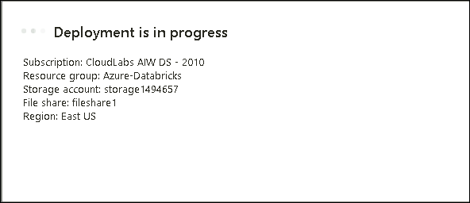

1. In the PowerShell pane, paste the following commands and Click enter to clone this repo:

    ```
    rm -r dp-203 -f
    git clone https://github.com/MicrosoftLearning/dp-203-azure-data-engineer dp-203
    ```

1. After the repo has been cloned, enter the following commands to change to the folder for this lab and run the **setup.ps1** script it contains:

    ```
    cd dp-203/Allfiles/labs/23
    ./setup.ps1
    ```

1. If prompted, choose which subscription you want to use (this will only happen if you have access to multiple Azure subscriptions).

1. Wait for the script to complete - this typically takes around 5 minutes, but in some cases may take longer. While you are waiting, review the [What is Azure Databricks?](https://learn.microsoft.com/azure/databricks/introduction/) article in the Azure Databricks documentation.

1. Once the Script has completed its execution, close the **cloud shell** window by clicking on the **X** which is located at the top right corner of **cloud shell**

## Task 2: Create a cluster

Azure Databricks is a distributed processing platform that uses Apache Spark *clusters* to process data in parallel on multiple nodes. Each cluster consists of a driver node to coordinate the work, and worker nodes to perform processing tasks.

In this task, you will create a cluster in the Azure Databricks Portal.

> **Note**: In this exercise, you'll create a *single-node* cluster to minimize the compute resources used in the lab environment (in which resources may be constrained). In a production environment, you'd typically create a cluster with multiple worker nodes.

1. In the Azure portal, in the **Search resources, services, and docs (G+/)** text box at the top of the Azure portal page, type **dp203-*xxxxxxx* (1)** resource group that was created by the script (or the resource group containing your existing Azure Databricks workspace) and select the **Resource group (2).**

   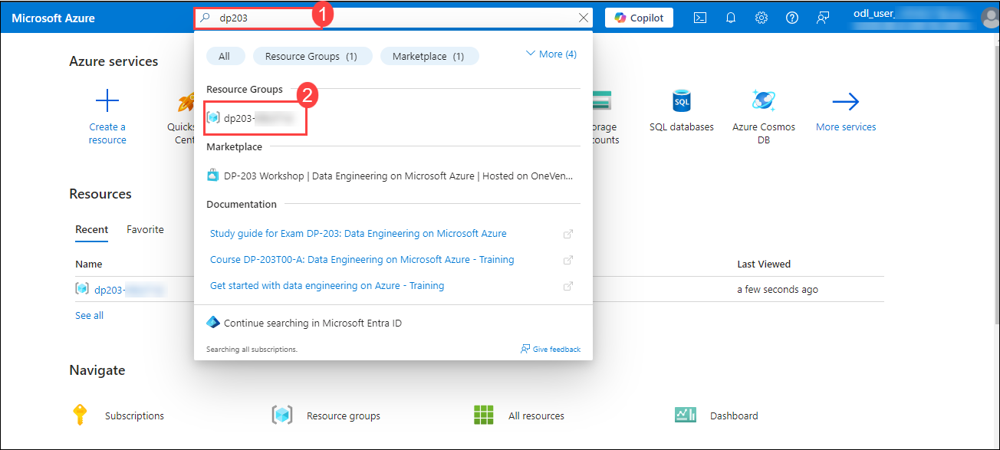
 
1. Select your Azure Databricks Service resource (named **databricks*xxxxxxx*** if you used the setup script to create it).

    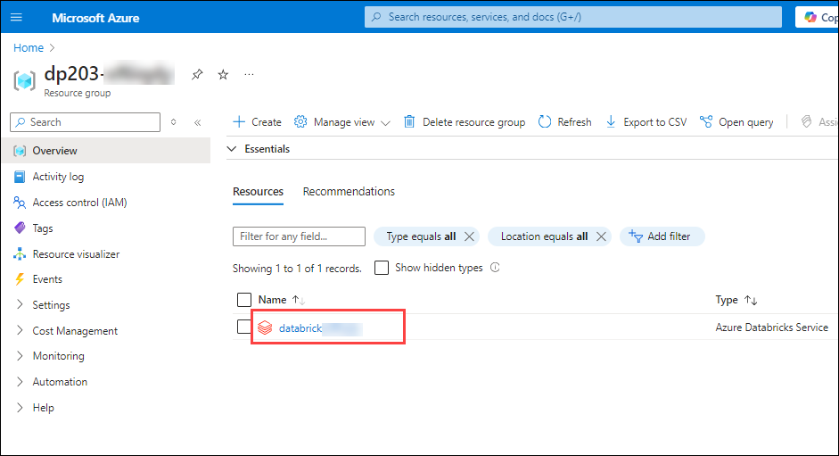

1. In the **Overview** page for your workspace, use the **Launch Workspace** button to open your Azure Databricks workspace in a new browser tab; signing in if prompted.

    

    > **Tip**: As you use the Databricks Workspace portal, various tips and notifications may be displayed. Dismiss these and follow the instructions provided to complete the tasks in this exercise.

1. View the Azure Databricks workspace portal and note that the sidebar on the left side contains links for the various types of task you can perform.

1. Select the **(+) New (1)** link in the sidebar, and then select **More (2)** ,then click on **Cluster (3)**.

    
 
1. In the **New Cluster** page, create a new cluster with the following settings
    - **Cluster name**: *User Name's* cluster (the default cluster name)
    - **Cluster mode (1)**: Single Node
    - **Access mode (2)**: Single user 
    - **Single user access (3)**: with your user account selected
    - **Databricks runtime version (4)**: 13.3 LTS (Spark 3.4.1, Scala 2.12)
    - **Use Photon Acceleration (5)**: Selected
    - **Node type (6)**: Standard_DS3_v2
    - **Terminate after (7)** *30* **minutes of inactivity**

   Once all the required settings is been provided click on **Create compute (8)**

    

1. Wait for the cluster to be created. It may take a minute or two.

    

> **Note**: If your cluster fails to start, your subscription may have insufficient quota in the region where your Azure Databricks workspace is provisioned. See [CPU core limit prevents cluster creation](https://docs.microsoft.com/azure/databricks/kb/clusters/azure-core-limit) for details. If this happens, you can try deleting your workspace and creating a new one in a different region. You can specify a region as a parameter for the setup script like this: `./setup.ps1 eastus`

## Task 3: Use Spark to analyze a data file

As in many Spark environments, Databricks supports the use of notebooks to combine notes and interactive code cells that you can use to explore data.

In this task, you will use notebook feature in Azure Databricks in which it uses Spark for querying and exploring data.

1. In the sidebar, use the **(+) New (1)** link to create a **Notebook (2)**.

    

1. Change the default notebook name (**Untitled Notebook *[date]***) to **Explore products**.

   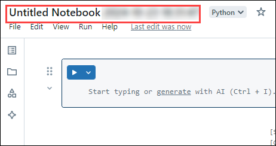

1. In the **Connect** drop-down list, select your cluster if it is not already selected. If the cluster is not running, it may take a minute or so to start.

   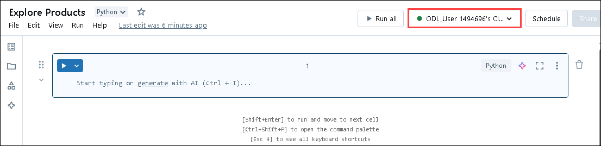

1. Download the [**products.csv**](https://raw.githubusercontent.com/MicrosoftLearning/dp-203-azure-data-engineer/master/Allfiles/labs/23/adventureworks/products.csv) file inside the LabVM, saving it as **products.csv**. Then, in the **Explore products** notebook, on the **File (1)** menu, select **Upload data to DBFS (2)**.

    

1. In the **Upload Data** dialog box, note the **DBFS Target Directory** to where the file will be uploaded. Then select the **Files** area, and upload the **products.csv (1)** file you downloaded to your computer. When the file has been uploaded, select **Next (2)**.

    
   
1. In the **Access files from notebooks** pane, select the sample PySpark code and **copy (1)** it to the clipboard. You will use it to load the data from the file into a DataFrame. Then select **Done (2)**.

   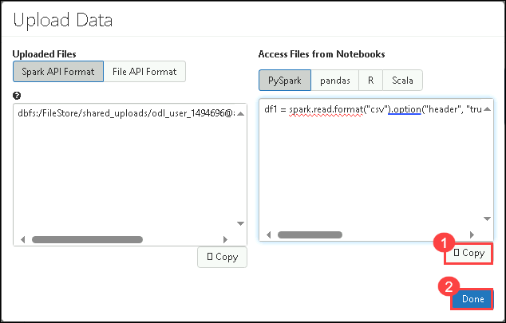
   
8. In the **Explore products** notebook, in the empty code cell, paste the code you copied; which should look similar to this:

    ```python
    df1 = spark.read.format("csv").option("header", "true").load("dbfs:/FileStore/shared_uploads/user@outlook.com/products.csv")
    ```

9. Use the **&#9656; Run Cell** menu option at the top-right of the cell to run it, starting and attaching the cluster if prompted.

    

10. Wait for the Spark job run by the code to complete. The code has created a *dataframe* object named **df1** from the data in the file you uploaded.
   
11. Under the existing code cell, use the **+** icon to add a new code cell. Then in the new cell, enter the following code:

    ```python
    display(df1)
    ```

13. Use the **&#9656; Run Cell** menu option at the top-right of the new cell to run it.

    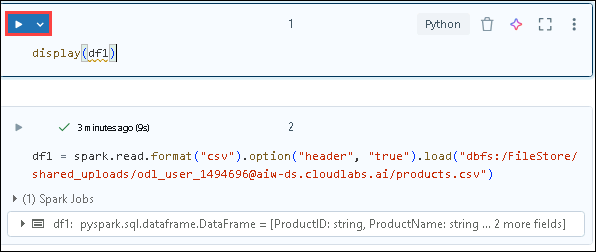
    
15. This code displays the contents of the dataframe, which should look similar to this:
    
    | ProductID | ProductName | Category | ListPrice |
    | -- | -- | -- | -- |
    | 771 | Mountain-100 Silver, 38 | Mountain Bikes | 3399.9900 |
    | 772 | Mountain-100 Silver, 42 | Mountain Bikes | 3399.9900 |
    | ... | ... | ... | ... |
    
17. Above the table of results, select **+ (1)** and then select **Visualization (2)** to view the visualization editor.

   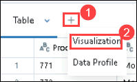
     
18.  Then apply the following options:
    - **Visualization type**: Bar
    - **X Column**: Category
    - **Y Column**: *Add a new column and select* **ProductID**. *Apply the* **Count** *aggregation*.

    Save the visualization and observe that it is displayed in the notebook, like this:

    

## Task 4: Create and query table

While many data analysis are comfortable using languages like Python or Scala to work with data in files, a lot of data analytics solutions are built on relational databases; in which data is stored in tables and manipulated using SQL.

In this task, you will use the notebook which is created previously and query data using various code cells.

1. In the **Explore products** notebook, under the chart output from the previously run code cell, use the **+** icon to add a new cell.

   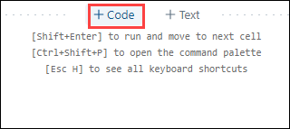
   
3. Enter and run the following code in the new cell:

    ```python
    df1.write.saveAsTable("products")
    ```

4. When the cell has completed, add a new cell under it with the following code:

    ```sql
    %sql

    SELECT ProductName, ListPrice
    FROM products
    WHERE Category = 'Touring Bikes';
    ```

5. Run the new cell, which contains SQL code to return the name and price of products in the *Touring Bikes* category. 
   
6. In the sidebar, select the **Catalog (1)** link, and verify that the **products (3)** table has been created in the **default database schema (2)** (which is unsurprisingly named **default**). It's possible to use Spark code to create custom database schemas and a schema of relational tables that data analysts can use to explore data and generate analytical reports.

   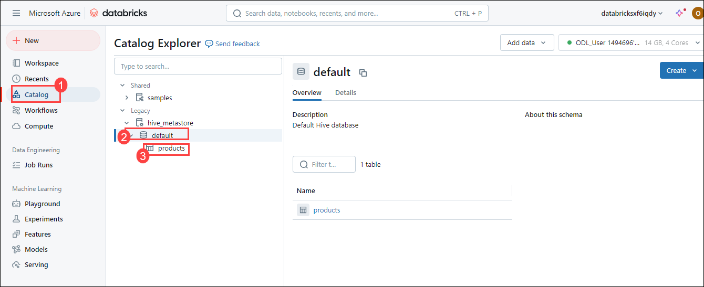

> **Congratulations** on completing the task! Now, it's time to validate it. Here are the steps:
> - Hit the Validate button for the corresponding task. If you receive a success message, you can proceed to the next task. 
> - If not, carefully read the error message and retry the step, following the instructions in the lab guide.
> - If you need any assistance, please contact us at labs-support@spektrasystems.com. We are available 24/7 to help

<validation step="ff89d27a-7f48-4720-8b81-36b2ae489171" />

## Summary

In this lab, you have performed key tasks to work with Azure Databricks and Spark. You provisioned an Azure Databricks workspace, created a cluster, used Spark to analyze a data file, and then created and queried a database table for data insights.

## You have successfully completed the lab.
