# Lab 04: Use a SQL Warehouse in Azure Databricks

## Lab Scenario

SQL is an industry-standard language for querying and manipulating data. Many data analysts perform data analytics by using SQL to query tables in a relational database. Azure Databricks includes SQL functionality that builds on Spark and Delta Lake technologies to provide a relational database layer over files in a data lake.

In this lab, you'll learn about Azure Databricks that provides SQL Warehouses that enable data analysts to work with data using familiar relational SQL queries.

### Lab Objectives

In this lab, you will perform:

 - Task 1: Provision an Azure Databricks workspace
 - Task 2: View and start a SQL Warehouse
 - Task 3: Create a database schema
 - Task 4: Create a table
 - Task 5: Create a query
 - Task 6: Create a dashboard

### Estimated timing: 60 minutes

### Architecture Diagram

   

## Task 1: Provision an Azure Databricks workspace

In this task, you'll use a script to provision a new Azure Databricks workspace.

1. In a web browser, sign into the [Azure portal](https://portal.azure.com) at `https://portal.azure.com`.
2. Use the **[\>_]** button to the right of the search bar at the top of the page to create a new Cloud Shell in the Azure portal.

    

    >**Note:** If you are not able to see the **[\>_]** button, click on the **ellipses (1)** to the right of the search bar at the top of the page and then select **Cloud Shell (2)** from the drop down options.

    

3. Selecting a ***PowerShell*** environment and creating storage if prompted. The cloud shell provides a command line interface in a pane at the bottom of the Azure portal, as shown here:

    

4. Within the Getting Started pane, select **Mount storage account (1)**, select your **Storage account subscription (2)** from the dropdown and click **Apply (3)**.

   

5. Within the **Mount storage account** pane, select **I want to create a storage account (1)** and click **Next (2)**.

   

6. If you are prompted to create storage for your Cloud Shell, ensure your **Subscription** is selected, Please make sure you have selected your **Resource Group** which is **Azure-Databricks (1)** , select **Region** from the drop-down **(US) East US (2)** and enter **storage<inject key="DeploymentID" enableCopy="false"/> (3)** for the **Storage account name** and enter **fileshare1 (4)** for the **File share name**, then click on **Create (5)**.
   
   

7. You can see a pop up appearing **Depployment is in Progress** ,Wait for PowerShell terminal to start.

    

8. In the PowerShell pane, paste the following commands and Click enter to clone this repo:

    ```
    rm -r dp-203 -f
    git clone -b prod https://github.com/CloudLabs-MOC/dp-203-azure-data-engineer dp-203
    ```

9. After the repo has been cloned, enter the following commands to change to the folder for this lab and run the **setup.ps1** script it contains:

    ```
    cd dp-203/Allfiles/labs/26
    ./setup.ps1
    ```

10. If prompted, choose which subscription you want to use (this will only happen if you have access to multiple Azure subscriptions).

11. Wait for the script to complete - this typically takes around 5 minutes, but in some cases may take longer. While you are waiting, review the [What is data warehousing on Azure Databricks?](https://learn.microsoft.com/azure/databricks/sql/) article in the Azure Databricks documentation.

    

12. Once the Script has completed its execution, close the **cloud shell** window by clicking on the **X** which is located at the top right corner of **cloud shell**

## Task 2: View and start a SQL Warehouse

In this task, you will launch workspace and you'll view and start SQL Warehouse.

1. When the Azure Databricks workspace resource has been deployed, go to it in the Azure portal.

2. In the Azure portal, in the **Search resources, services, and docs (G+/)** text box at the top of the Azure portal page, type **dp203-*xxxxxxx* (1)** resource group that was created by the script (or the resource group containing your existing Azure Databricks workspace) and select the **Resource group (2).**

   
 
3. Select your Azure Databricks Service resource (named **databricks*xxxxxxx*** if you used the setup script to create it).

    

4. In the **Overview** page for your workspace, use the **Launch Workspace** button to open your Azure Databricks workspace in a new browser tab; signing in if prompted.

    

    > **Tip**: As you use the Databricks Workspace portal, various tips and notifications may be displayed. Dismiss these and follow the instructions provided to complete the tasks in this exercise.

5. View the Azure Databricks workspace portal and note that the sidebar on the left side contains links for the various types of task you can perform.
  
6. In the sidebar, under **SQL (1)**, select **SQL Warehouses (2)**.

   

7. Observe that the workspace already includes a SQL Warehouse named **Serverless Starter Warehouse**.

   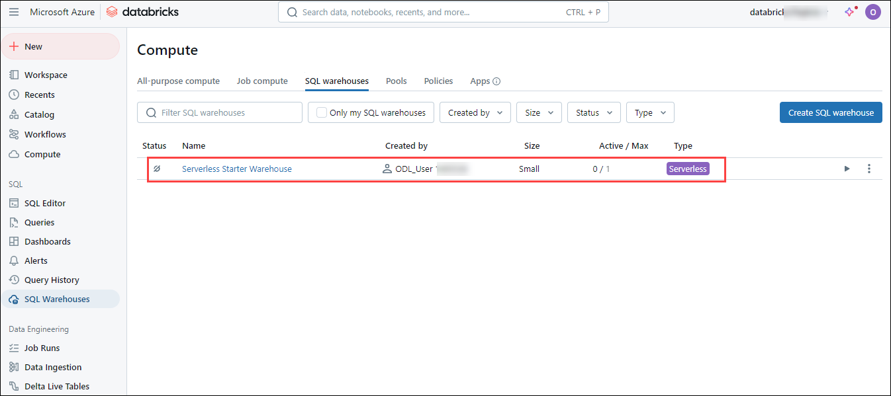

8. In the **Actions** (**&#8285;**) **(1)** menu for the SQL Warehouse, select **Edit (2)**.

    

9. A Page appears where in you can configure the Cluster size,set the **Cluster size** property to **2X-Small (1)** and **Save (2)** your changes.

    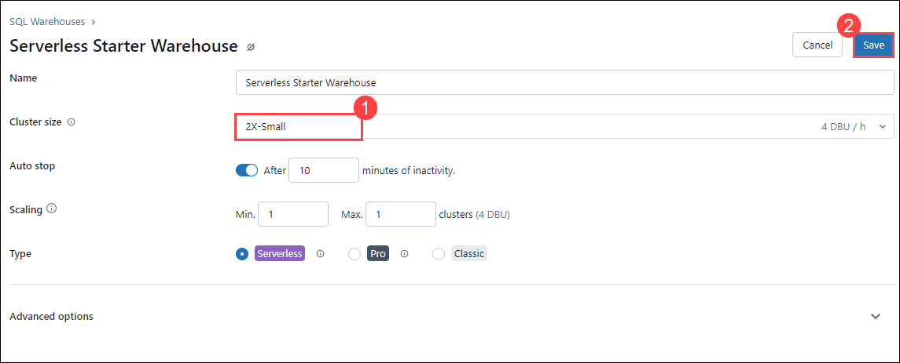
    
12. Use the **Start** button to start the SQL Warehouse (which may take a minute or two).

    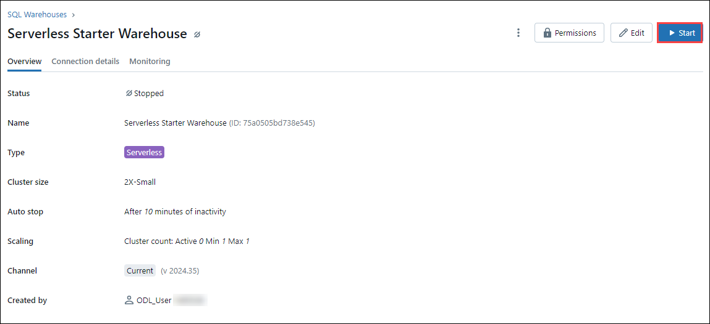

13. Now your SQL Warehouse will be up and in running state.

    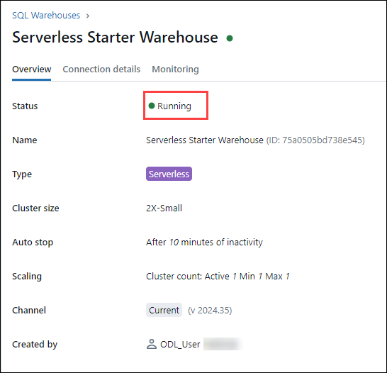

> **Note**: If your SQL Warehouse fails to start, your subscription may have insufficient quota in the region where your Azure Databricks workspace is provisioned. See [Required Azure vCPU quota](https://docs.microsoft.com/azure/databricks/sql/admin/sql-endpoints#required-azure-vcpu-quota) for details. If this happens, you can try requesting for a quota increase as detailed in the error message when the warehouse fails to start. Alternatively, you can try deleting your workspace and creating a new one in a different region. You can specify a region as a parameter for the setup script like this: `./setup.ps1 eastus`

## Task 3: Create a database schema

In this task, you will be creating database schema in your Azure Databricks Portal.

1. When your SQL Warehouse is *running*, select **SQL Editor** in the sidebar.

   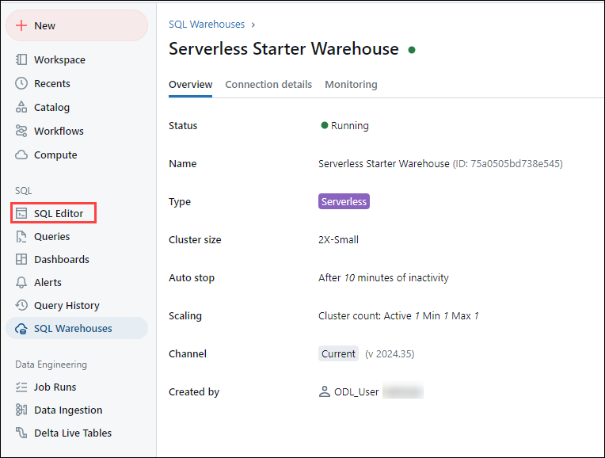

3. In the **Schema browser** pane, observe that the *hive_metastore* catalog contains a database named **default**.

   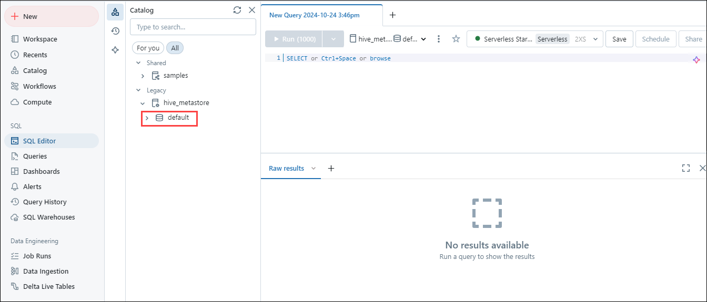
   
5. In the **New query** pane, enter the following SQL code:

    ```sql
    CREATE SCHEMA adventureworks;
    ```    
6. Use the **&#9658;Run (1000)** button to run the SQL code.

   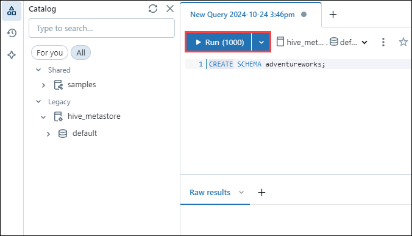

8. When the code has been successfully executed, in the **Schema browser** pane, use the refresh button at the bottom of the pane to refresh the list. Then expand **hive_metastore (1)** and **adventureworks (2)**, and observe that the database has been created, but contains no tables.

   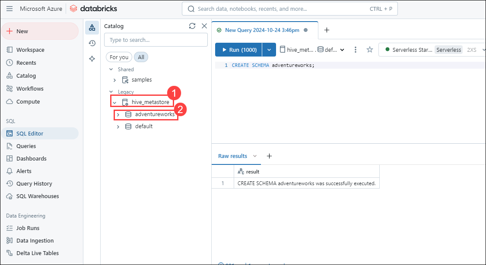

You can use the **default** database for your tables, but when building an analytical data store its best to create custom databases for specific data.

## Task 4: Create a table

In this task, you will create a table schema using an external file.

1. Download the [**products.csv**](https://github.com/MicrosoftLearning/dp-203-azure-data-engineer/blob/master/Allfiles/labs/26/data/products.csv) file to your local computer to download the file press ctrl+s, saving it as **products.csv**, .

2. In the Azure Databricks workspace portal, in the sidebar, select **(+) New (1)** and then select **Add or upload data (2)**

    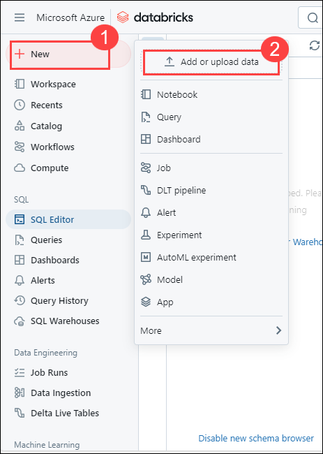

3. In order to upload the **products.csv** file , click on **Create or modify table**.

   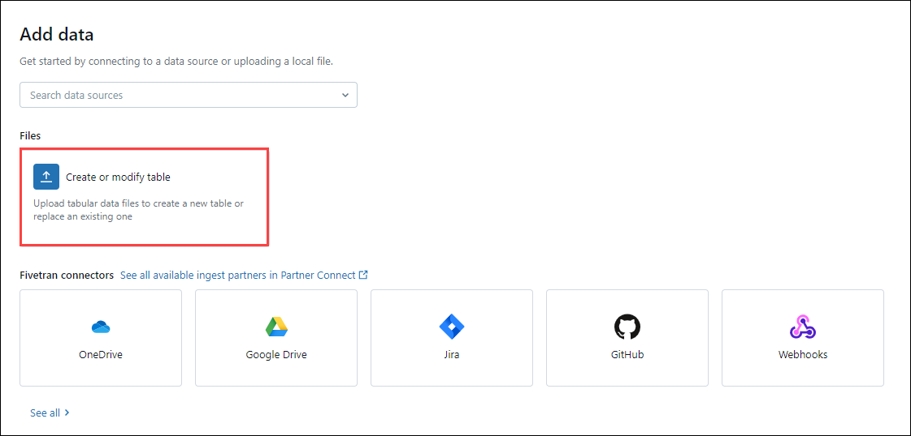

4. Then click on **browse** to upload the file that you have downloaded to your computer.

   

5. Once **products.csv** file has been uploaded **(1)**. In the **Add data** page, select the **adventureworks (2)** database from schema dropdown and set the table name to **products (3)**. Then select **Create table (4)** on the bottom right corner of the page.

   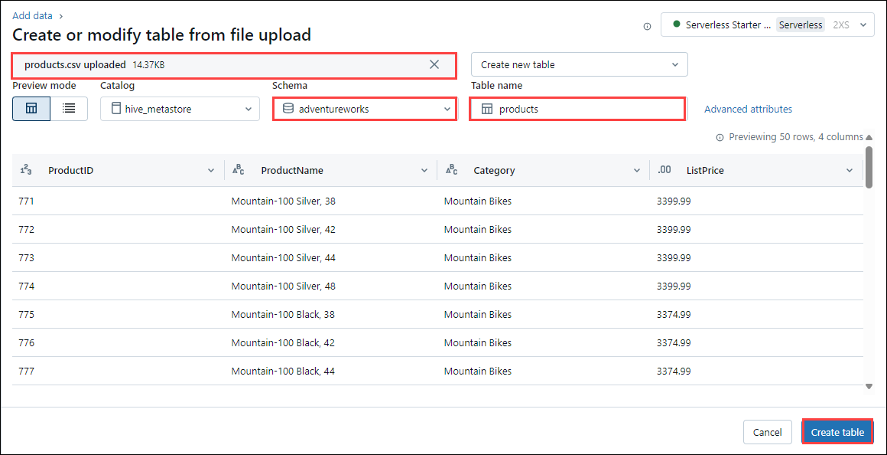

6. Now the table named **products** has been created under **adventureworks** database, review the table details.

   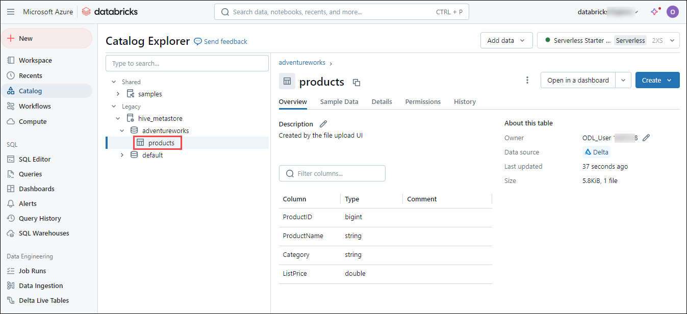

The ability to create a table by importing data from a file makes it easy to populate a database. You can also use Spark SQL to create tables using code. The tables themselves are metadata definitions in the hive metastore, and the data they contain is stored in Delta format in Databricks File System (DBFS) storage.

## Task 5: Create a query

In this task, you will create a query in the adventureworks database which is created earlier.

1. In the sidebar, select **(+) New (1)** and then select **Query (2)**.

   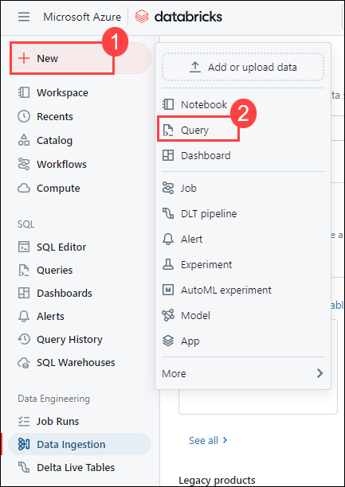

2. In the **Schema browser** pane, expand **hive_metastore** and **adventureworks**, and verify that the **products** table is listed.

   

3. In the **New query** pane, enter the following SQL code:

    ```sql
    SELECT ProductID, ProductName, Category
    FROM adventureworks.products; 
    ```

4. Use the **&#9658;Run (1000)** button to run the SQL code.

    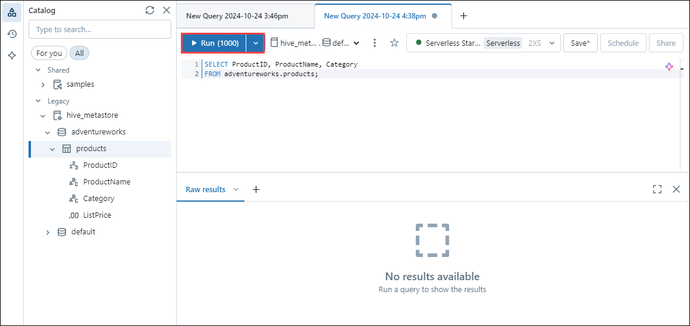

5. When the query has completed, review the table of results.

   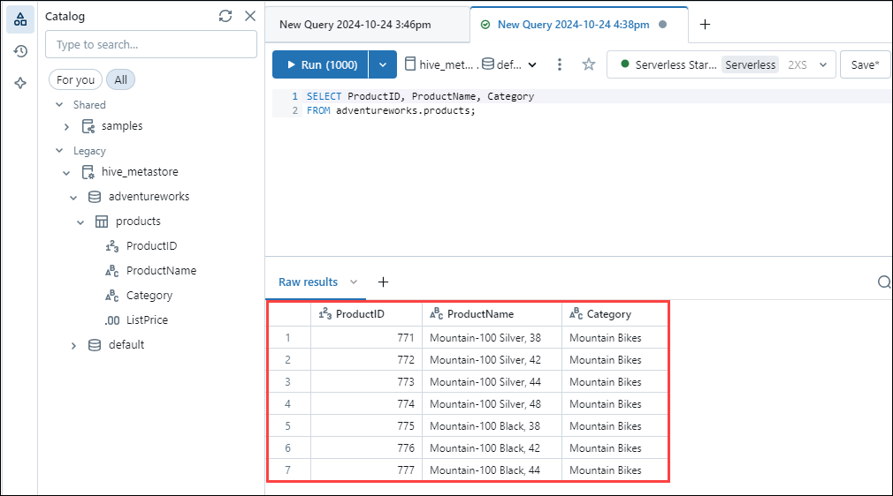

6. Use the **Save** button at the top right of the query editor to save the query.

    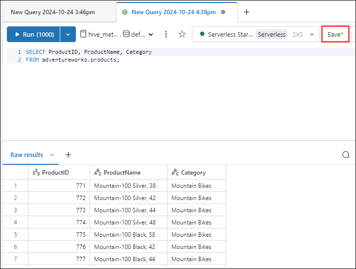
  
7. Save the query by the name **Products and Categories (1)** and then click on **Save (2)**.

     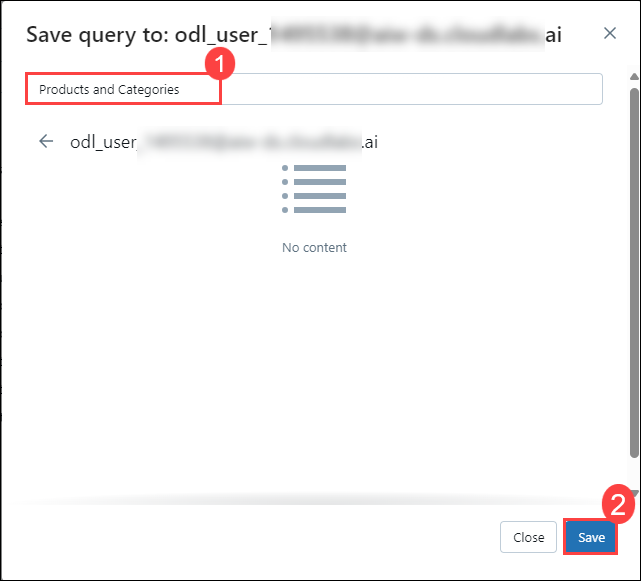

Saving a query makes it easy to retrieve the same data again at a later time.

## Task 6: Create a dashboard

In this task, you will be creating a dashboard to visualize the data of Products dataset.

1. In the sidebar, select **Catalog (1)** ,select **hive_metastore > adventureworks > products (2)**.

2. In the products, select dropdown **Create (3) > Dashboard (4)**

   

3. In the dialog box, change the name to **Adventure Works Products (1)**.

4. Click on the **Add a visualization** **(2)** dialog box, select the **Products (3)** dataset.

5. In the visualization editor, set the following properties:
    - **Visualization type (4)**: bar
    - **X columns (5)**: Product ID : Count

      >**Note:** Click on **+** icon beside X column and then select **Product ID** from the drop down , initially it appears as **SUM(ProductID)**, Hence click on **SUM(ProductID)** and change **SUM** to **Count**.
       
    - **Y column (6)**: Category
    - **color/Group by**: *Leave blank*

    Then **Publish (7)** the visualization.
   
    
   
7. A pop up appears, click on **Publish**.

    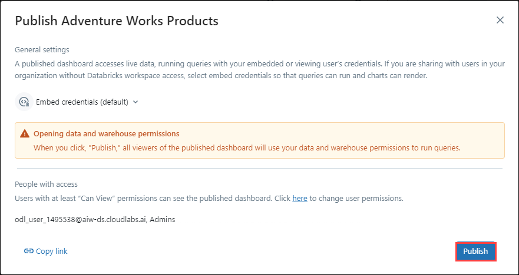

8. Now the Dashboard has been Published successfully. Click on **here** to view the Dashboard. Alternatively you can also view the dashboard by navigating to the **Dashboard** at the left pane.

   

   
   
Dashboards are a great way to share data tables and visualizations with business users. You can schedule the dashboards to be refreshed periodically, and emailed to subscribers.

> **Congratulations** on completing the task! Now, it's time to validate it. Here are the steps:
> - Hit the Validate button for the corresponding task. If you receive a success message, you can proceed to the next task. 
> - If not, carefully read the error message and retry the step, following the instructions in the lab guide.
> - If you need any assistance, please contact us at cloudlabs-support@spektrasystems.com. We are available 24/7 to help

<validation step="0e124d80-b14d-4de2-b75e-47fb394bba8b" />

 ## Summary

In this lab, you have performed a series of tasks to work with Azure Databricks. You provisioned an Azure Databricks workspace, viewed and started a SQL Warehouse, created a database and a table, wrote a query, and created a dashboard to visualize your data.
 
 ## You have successfully completed the lab.
