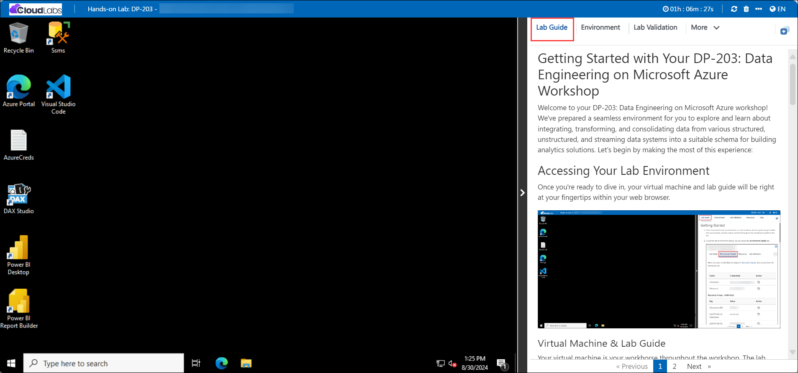
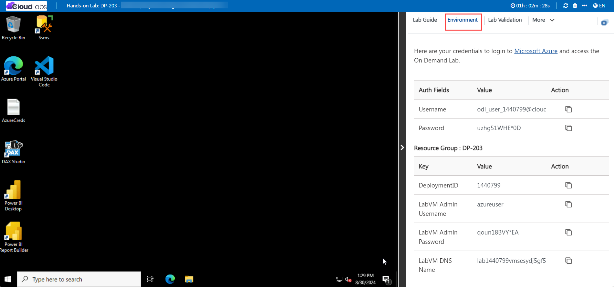
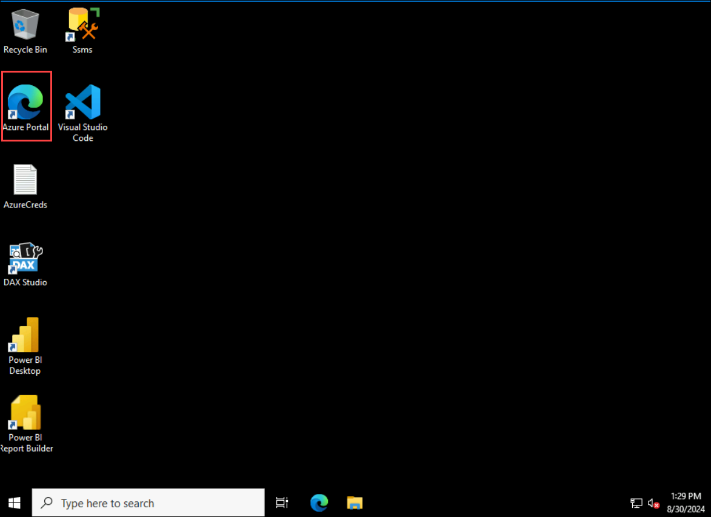

# Getting Started with Your AI-enabled data workloads in PostgreSQL and Azure Cosmos DB workshop
 
Welcome to your AI-enabled data workloads in PostgreSQL and Azure Cosmos DB workshop! We've prepared a seamless environment for you to explore the integration of AI capabilities into your data workloads using PostgreSQL and Azure Cosmos DB. Through a series of hands-on labs, you will learn how to enable AI in PostgreSQL databases with the Azure AI extension, enrich your data with advanced AI-driven insights, and implement powerful vector search functionalities using Azure Cosmos DB for NoSQL. By the end of this course, you'll have a solid understanding of how to enhance your data solutions with cutting-edge AI technologies in these popular database platforms. Let's begin by making the most of this experience:
 
## Accessing Your Lab Environment
 
Once you're ready to dive in, your virtual machine and lab guide will be right at your fingertips within your web browser.
 

### Virtual Machine & Lab Guide

Your virtual machine is your workhorse throughout the workshop. The lab guide is your roadmap to success.
 
## Exploring Your Lab Resources
 
To get a better understanding of your lab resources and credentials, navigate to the **Environment Details** tab.
 

 
## Utilizing the Split Window Feature
 
For convenience, you can open the lab guide in a separate window by selecting the **Split Window** button from the Top right corner.
 

 
## Managing Your Virtual Machine
 
Feel free to start, stop, or restart your virtual machine as needed from the **Resources** tab. Your experience is in your hands!
 

## **Lab Duration Extension**

1. To extend the duration of the lab, kindly click the **Hourglass** icon in the top right corner of the lab environment. 

    

    >**Note:** You will get the **Hourglass** icon when 10 minutes are remaining in the lab.

2. Click **OK** to extend your lab duration.
 
   

3. If you have not extended the duration prior to when the lab is about to end, a pop-up will appear, giving you the option to extend. Click **OK** to proceed.
 
## Let's Get Started with Azure Portal
 
1. On your virtual machine, click on the Azure Portal icon as shown below:
 
   

2. You'll see the **Sign into Microsoft Azure** tab. Here, enter your credentials:
 
   - **Email/Username:** <inject key="AzureAdUserEmail"></inject>
 
       
 
3. Next, provide your password:
 
   - **Password:** <inject key="AzureAdUserPassword"></inject>
 
      

4. If **Action required** pop-up window appears, click on **Ask later**.

   
 
5. If prompted to stay signed in, you can click "No."
 
6. If a **Welcome to Microsoft Azure** pop-up window appears, simply click **Cancel** to skip the tour.
 
7. Click **Next** from the bottom right corner to embark on your Lab journey!
 
   .png)
 
Now you're all set to explore the powerful world of technology. Feel free to reach out if you have any questions along the way. Enjoy your workshop!
