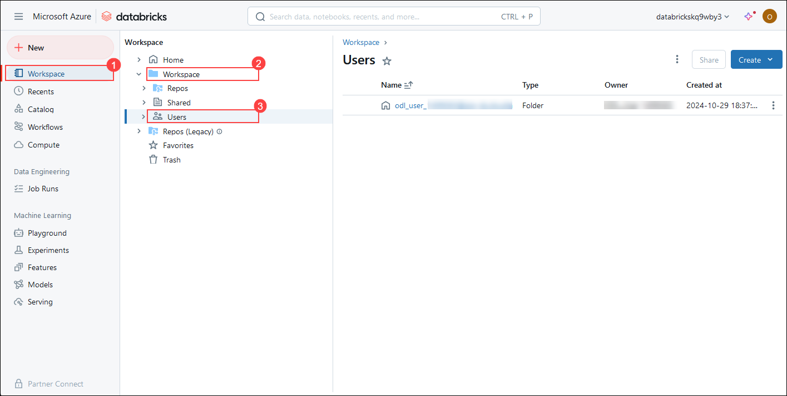
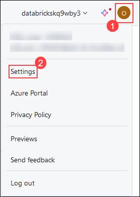
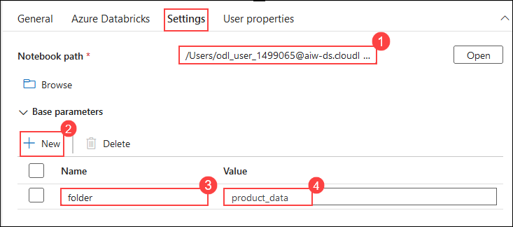

# Hands-on Lab : Create and run Data Pipeline with Data Factory

### Estimated Duration: 120 minutes

You can use notebooks in Azure Databricks to perform data engineering tasks, such as processing data files and loading data into tables. When you need to orchestrate these tasks as part of a data engineering pipeline, you can use Azure Data Factory.

In this lab, you'll explore about notebooks in Azure Databricks to perform data engineering tasks, such as processing data files and loading data into tables.

## Lab Objectives

You will be able to complete the following tasks:

 - Task 1: Provision Azure resources
 - Task 2: Import a notebook
 - Task 3: Enable Azure Databricks integration with Azure Data Factory
 - Task 4: Use a pipeline to run the Azure Databricks notebook

## Task 1: Provision Azure resources

In this exercise, you'll use a script to provision a new Azure Databricks workspace and an Azure Data Factory resource in your Azure subscription.

1. In a web browser, sign into the [Azure portal](https://portal.azure.com) at `https://portal.azure.com`.

1. Use the **[\>_]** button to the right of the search bar at the top of the page to create a new Cloud Shell in the Azure portal. Selecting a ***PowerShell*** environment and creating storage if prompted. The cloud shell provides a command line interface in a pane at the bottom of the Azure portal, as shown here:

    

1. Within the Getting Started pane, select **Mount storage account (1)**, select your **Storage account subscription (2)** from the dropdown and click **Apply (3)**.

    

1. Within the **Mount storage account** pane, select **I want to create a storage account (1)** and click **Next (2)**.

    

1. If you are prompted to create storage for your Cloud Shell, ensure your **Subscription** is selected, Please make sure you have selected your **Resource Group** which is **Azure-Databricks (1)** , select **Region** from the drop-down **(US) East US (2)** and enter **storage<inject key="DeploymentID" enableCopy="false"/> (3)** for the **Storage account name** and enter **fileshare<inject key="DeploymentID" enableCopy="false"/> (4)** for the **File share name**, then click on **Create (5)**.

    

1. You can see a pop up appearing **Deployment is in Progress** ,Wait for PowerShell terminal to start.

    

1. In the PowerShell pane, enter the following commands to clone this repo:

    ```
    rm -r dp-203 -f
    git clone https://github.com/MicrosoftLearning/dp-203-azure-data-engineer dp-203
    ```

1. After the repo has been cloned, enter the following commands to change to the folder for this lab and run the **setup.ps1** script it contains:

    ```
    cd dp-203/Allfiles/labs/27
    ./setup.ps1
    ```

1. If prompted, choose which subscription you want to use (this will only happen if you have access to multiple Azure subscriptions).

1. Wait for the script to complete - this typically takes around 5 minutes, but in some cases may take longer. While you are waiting, review [What is Azure Data Factory?](https://docs.microsoft.com/azure/data-factory/introduction).

1. When the script has completed, close the cloud shell pane and browse to the **dp203-*xxxxxxx*** resource group that was created by the script to verify that it contains an Azure Databricks workspace and an Azure Data Factory (V2) resource (you may need to refresh the resource group view).

    

## Task 2: Import a notebook

You can create notebooks in your Azure Databricks workspace to run code written in a range of programming languages. 

In this exercise, you'll import an existing notebook that contains some Python code.

1. In the Azure portal, in the **dp203-*xxxxxxx*** resource group, select the **databricks*xxxxxxx*** Azure Databricks Service resource.

    

1. In the **Overview** page for **databricks*xxxxxxx***, use the **Launch Workspace** button to open your Azure Databricks workspace in a new browser tab; signing in if prompted.

    

1. If a **What's your current data project?** message is displayed, select **Finish** to close it. Then view the Azure Databricks workspace portal and note that the sidebar on the left side contains icons for the various tasks you can perform. The sidebar expands to show the names of the task categories.

    

1. Expand the sidebar and select the **Workspace (1)** tab. Then under the **Workspace (2)** folder, select **Users (3)** folder. 

    

1. Click on the **&#8942; (1)** menu next to your user name, select **Import (2)**.

    

1.  Then in the **Import** dialog box, select **URL (1)** , in the **URL** import the notebook from `https://github.com/MicrosoftLearning/dp-203-azure-data-engineer/raw/master/Allfiles/labs/27/Process-Data.ipynb` **(2)** and then click on **Import (3)**.

    

1. Expand the sidebar and select the **Workspace (1)** tab. Then in the **Home (2)** folder, open the **Process-Data (3)** notebook you just imported.

    

    **Note**: If a tip is displayed, use the **Got it** button to close it. This applies to any future tips that may be displayed as you navigate the workspace interface for the first time.

1. Review the contents of the notebook, which include some Python code cells to:
    
    - Retrieve a parameter named **folder** if it is has been passed (otherwise use a default value of *data*).
    
    - Download data from GitHub and save it in the specified folder in the Databricks File System (DBFS).
    
    - Exit the notebook, returning the path where the data was saved as an output

       > **Tip**: The notebook could contain practically any data processing logic you need. This simple example is designed to show the key principles.

## Task 3: Enable Azure Databricks integration with Azure Data Factory

To use Azure Databricks from an Azure Data Factory pipeline, you need to create a linked service in Azure Data Factory that enables access to your Azure Databricks workspace.

In this task, you will generate a access token in the Azure Databricks Portal and create a linked service in Azure Data Factory.

### Task 3.1: Generate an access token

1. In the Azure Databricks portal, at on the top right menu bar, select the **username (1)** and then select **Settings (2)** from the drop-down.

    

1. In the **Settings** page, select **Developer (1)**. Then next to **Access tokens** select **Manage (2).**

    

1. Select **Generate new token** and generate a new token with the comment **Data Factory (1)** and a **blank lifetime (2)** (so the token doesn't expire) and then click on **Generate (3).**

    

    

1. Be careful to **copy (1) the token when it is displayed <u>before</u> selecting *Done (2).***

    

1. Paste the copied token to a text file so you have it handy for later in this exercise.

### Task 3.2: Create a linked service in Azure Data Factory


1. Return to the Azure portal, and in the **dp203-*xxxxxxx*** resource group, select the **adf*xxxxxxx*** Azure Data Factory resource.

    

1. On the **Overview** page, select the **Launch studio** to open the Azure Data Factory Studio. Sign in if prompted.

    

1. In Azure Data Factory Studio, use the **>>** icon to expand the navigation pane on the left. Then select the **Manage** page.

    

1. On the **Manage** page, in the **Linked services (1)** tab, select **+ New (2)** to add a new linked service.

    

1. In the **New linked service** pane, select the **Compute (1)** tab at the top. Then select **Azure Databricks (2)** and click on **Continue (3)**.

    

1. Create the linked service with the following settings:
    - **Name (1)**: AzureDatabricks
    - **Description (2)**: Azure Databricks workspace
    - **Connect via integration runtime (3)**: AutoResolveIntegrationRuntime
    - **Account selection method (4)**: From Azure subscription
    - **Azure subscription (5)**: *Select your subscription*
    - **Databricks workspace (6)**: *Select your **databricksxxxxxxx** workspace*
    - **Select cluster (7)**: New job cluster
    - **Databrick Workspace URL (8)**: *Automatically set to your Databricks workspace URL*
    - **Authentication type (9)**: Access token
    - **Access token (10)**: *Paste your access token*
    - **Cluster version (11)**: 11.3 LTS (includes Apache Spark 3.3.0, Scala 2.12)
    - **Cluster node type (12)**: Standard_DS3_v2
    - **Python version (13)**: 3
    - **Worker options (14)**: Fixed
    - **Workers (15)**: 1
  
      Once all the neccessary fields are provided click on **Create (16).**

    

    

## Task 4: Use a pipeline to run the Azure Databricks notebook

Now that you have created a linked service, you can use it in a pipeline to run the notebook you viewed previously.

In this task, you will create a pipeline and use it to run the Azure Databricks Notebook.

### Task 4.1: Create a pipeline

1. In Azure Data Factory Studio, in the navigation pane, select **Author (1)**.

1. On the **Author** page, in the **Factory Resources** pane, use the **+ (2)** icon then choose **Pipeline (3) > Pipeline (4)**. to add a **Pipeline**.

    

1. In the **Properties** pane for the new pipeline, change its name to **Process Data with Databricks (1)**. Then use the **Properties (2)** button (which looks similar to **&#128463;<sub>*</sub>**) on the right end of the toolbar to hide the **Properties** pane.

    

1. In the **Activities (1)** pane, expand **Databricks (2)** and drag a **Notebook (3)** activity to the pipeline designer surface.

    

1. With the new **Notebook1** activity selected, set the following properties in the bottom pane:
    
    - **General**:
        
        - **Name**: Process Data
    
    - **Azure Databricks**:
        
        - **Databricks linked service**: *Select the **AzureDatabricks** linked service you created previously*
    
    - **Settings**:
        
        - **Notebook path (1)**: *Browse to the **Users/your_user_name** folder and select the **Process-Data** notebook*
        
        - **Base parameters**: *Add a **new (2)** parameter named **folder (3)** with the value **product_data (4)***

        

    

    

6. Use the **Validate (1)** button above the pipeline designer surface to validate the pipeline. Then use the **Publish all (2)** button to publish (save) it.

    

    

### Task 4.2: Run the pipeline

1. Above the pipeline designer surface, select **Add trigger (1)**, and then select **Trigger now (2)**.

    

1. In the **Pipeline run** pane, select **OK** to run the pipeline.

1. In the navigation pane on the left, select **Monitor** and observe the **Process Data with Databricks** pipeline on the **Pipeline runs** tab. It may take a while to run as it dynamically creates a Spark cluster and runs the notebook. You can use the **&#8635; Refresh** button on the **Pipeline runs** page to refresh the status.

    

    > **Note**: If your pipeline fails, your subscription may have insufficient quota in the region where your Azure Databricks workspace is provisioned to create a job cluster. See [CPU core limit prevents cluster creation](https://docs.microsoft.com/azure/databricks/kb/clusters/azure-core-limit) for details. If this happens, you can try deleting your workspace and creating a new one in a different region. You can specify a region as a parameter for the setup script like this: `./setup.ps1 eastus`

1. When the run succeeds, select its name to view the run details. Then, on the **Process Data with Databricks** page, in the **Activity Runs** section, select the **Process Data** activity and use its ***output*** icon to view the output JSON from the activity, which should resemble this:

    ```json
    {
        "runPageUrl": "https://adb-..../run/...",
        "runOutput": "dbfs:/product_data/products.csv",
        "effectiveIntegrationRuntime": "AutoResolveIntegrationRuntime (East US)",
        "executionDuration": 61,
        "durationInQueue": {
            "integrationRuntimeQueue": 0
        },
        "billingReference": {
            "activityType": "ExternalActivity",
            "billableDuration": [
                {
                    "meterType": "AzureIR",
                    "duration": 0.03333333333333333,
                    "unit": "Hours"
                }
            ]
        }
    }
    ```

    

1. Note the **runOutput** value, which is the *path* variable to which the notebook saved the data.

## Summary

In this lab, you have performed tasks to integrate Azure Databricks with Azure Data Factory. You imported a notebook, enabled Azure Databricks integration with Azure Data Factory, and used a pipeline to run the Azure Databricks notebook efficiently.

### You have successfully completed the lab.

