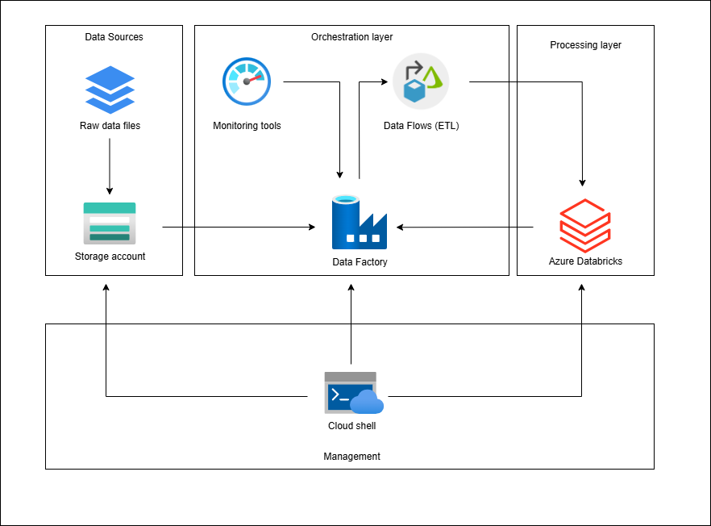
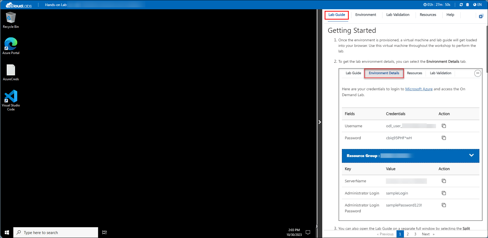
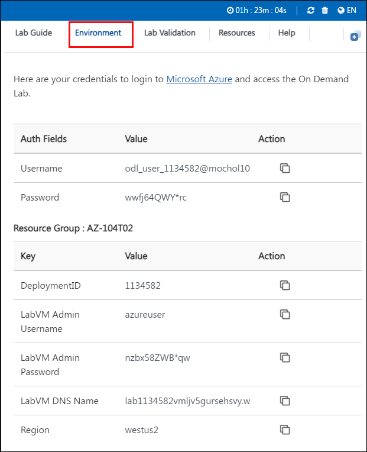
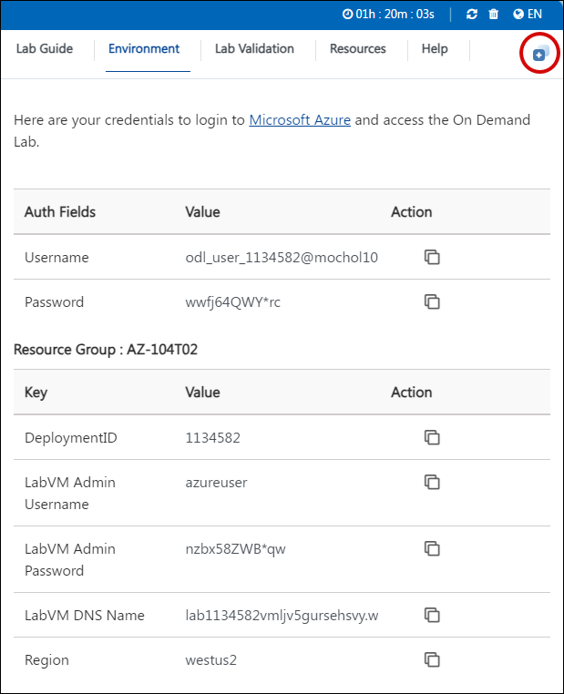

# Create and Run Data Pipeline with Data Factory

### Overall Estimated Duration: 2 hours

## Overview

The "Create and Run Data Pipeline with Data Factory" lab is a practical workshop designed to teach participants the fundamentals of using Azure Data Factory to build and manage data pipelines. This hands-on experience introduces users to integrating Azure Databricks for data engineering tasks, such as processing and loading data into tables. The lab begins with provisioning Azure resources, including setting up an Azure Databricks workspace and Azure Data Factory instance. Participants will then use Data Factory to orchestrate a data pipeline, practicing essential tasks like configuring data flows, managing data transformations, and automating workflows within Azure. Through structured exercises, attendees gain a foundational understanding of building scalable data solutions using Azure's cloud-native tools, preparing them for more advanced data engineering and integration tasks in a modern data ecosystem.

## Objective

This lab is designed to provide participants with practical experience in creating, configuring, and managing data pipelines using Azure Data Factory in conjunction with Azure Databricks. Participants will gain insights into data pipeline orchestration, learning how to:

- **Provision Azure Resources:** Set up an Azure Databricks workspace and Azure Data Factory instance within Azure, preparing the environment for data engineering tasks.

- **Orchestrate Data Pipelines:** Utilize Azure Data Factory to automate data flows and build pipelines that integrate and transform data from multiple sources.

- **Implement Data Transformations:** Leverage Data Factory’s capabilities to design and execute data transformation workflows, enabling efficient data preparation for analytics.

- **Monitor and Manage Pipelines:** Track pipeline performance and troubleshoot issues in real-time using Data Factory’s monitoring tools, ensuring data processes run smoothly and efficiently.

By the end of this lab, participants will have developed foundational skills in Azure Data Factory and Databricks, equipping them to build scalable, reliable data workflows and integration solutions on the Azure platform.

## Prerequisites

Participants should have:

- **Basic Knowledge of Azure and Data Engineering**: Familiarity with Azure services and foundational concepts in data engineering and data processing.

- **Active Azure Subscription**: Access to an active Azure subscription to provision and manage Azure resources.

- **Familiarity with Azure Portal**: Experience navigating the Azure Portal to deploy and configure resources.

- **Command-Line Interface (CLI) Skills**: Basic understanding of using the Azure Cloud Shell, PowerShell, or Bash for executing setup scripts.

- **Understanding of Data Pipelines and ETL**: Basic knowledge of Extract, Transform, Load (ETL) processes and data pipeline orchestration.

These prerequisites will help participants fully engage with the lab exercises, enabling them to efficiently set up and manage the required resources and workflows.

## Architecture

This lab architecture combines key Azure services to create a streamlined data engineering workflow, primarily using Azure Data Factory and Azure Databricks. Data begins in an **Azure Storage Account**, which serves as the primary source for raw data files. **Azure Data Factory** acts as the main orchestration tool, coordinating Extract, Transform, Load (ETL) processes and managing data flows. Within Data Factory, **Data Flows** are configured to handle data transformations such as data cleansing,enrichment, and preparation. Data Factory then integrates with **Azure Databricks** to perform more complex data processing and transformation using Apache Spark, allowing for scalable and collaborative data manipulation.

To simplify resource management and streamline setup, **Azure Cloud Shell** provides a command-line interface to execute provisioning scripts directly within the Azure portal. **Monitoring Tools** within Data Factory provide real-time tracking and visibility into data pipeline execution, helping ensure that workflows operate smoothly and efficiently. Together, this architecture enables participants to build and manage robust, scalable data workflows, preparing them for sophisticated data engineering and integration tasks on the Azure platform.

## Architecture Diagram

## Explanation of Components

The architecture for this lab incorporates several essential components:

- **Azure Data Factory**: Acts as the primary orchestration tool to automate data workflows, managing ETL processes and enabling the integration of data from multiple sources into a cohesive pipeline.
  
- **Azure Databricks**: Provides a collaborative environment for processing and transforming data using Apache Spark. In this lab, Databricks is used to process data files and prepare data for loading into tables.

- **Azure Storage Account**: Stores data files that serve as the raw input for the data pipelines. The files uploaded here can be accessed by both Azure Data Factory and Databricks for processing and transformation tasks.

- **Azure Cloud Shell**: A command-line interface in the Azure Portal, used to run provisioning scripts and manage resources. This shell supports PowerShell or Bash, providing flexibility in script execution.

- **Data Flows**: Configured within Azure Data Factory to define data transformation steps, allowing users to manipulate, cleanse, and shape data before it is loaded into destination tables.

- **Monitoring Tools**: Built into Azure Data Factory to track the status and performance of pipelines in real-time, offering visibility into data flow progress, errors, and execution times for efficient troubleshooting.

These components work together to create a fully orchestrated data pipeline that ingests, transforms, and prepares data for further analytics or reporting, demonstrating the power of Azure Data Factory and Databricks in handling data engineering workflows.

## Getting Started with Lab

Welcome to your Create and run data pipeline with Data Factory lab! We've prepared a seamless environment for you to explore and learn about Azure services. Let's begin by making the most of this experience:

## Accessing Your Lab Environment

Once you're ready to dive in, your virtual machine and lab guide will be right at your fingertips within your web browser.

### Virtual Machine & Lab Guide

Your virtual machine is your workhorse throughout the workshop. The lab guide is your roadmap to success.

## Exploring Your Lab Resources

To get a better understanding of your lab resources and credentials, navigate to the **Environment** tab.

## Utilizing the Split Window Feature

For convenience, you can open the lab guide in a separate window by selecting the **Split Window** button from the Top right corner.

## Managing Your Virtual Machine

Feel free to start, stop, or restart your virtual machine as needed from the **Resources** tab. Your experience is in your hands!

## Let's Get Started with Azure Portal

1. On your virtual machine, click on the Azure Portal icon as shown below:

    

1. You'll see the **Sign into Microsoft Azure** tab. Here, enter your credentials:

    * Email/Username: <inject key="AzureAdUserEmail"></inject>

    

1. Next, provide your password:

    * Password: <inject key="AzureAdUserPassword"></inject>

    

1. If you see the pop-up **Action Required**, click **Ask Later**.

    

1. First-time users are often prompted to **Stay Signed In**, if you see any such pop-up, click on No.

1. If a **Welcome to Microsoft Azure** popup window appears, click **Cancel** to skip the tour.

## Support Contact

The CloudLabs support team is available 24/7, 365 days a year, via email and live chat to ensure seamless assistance at any time. We offer dedicated support channels tailored specifically for both learners and instructors, ensuring that all your needs are promptly and efficiently addressed.

Learner Support Contacts:

- Email Support: cloudlabs-support@spektrasystems.com
- Live Chat Support: https://cloudlabs.ai/labs-support

Now, click on **Next** from the lower right corner to move on to the next page.

### Happy Learning!!
